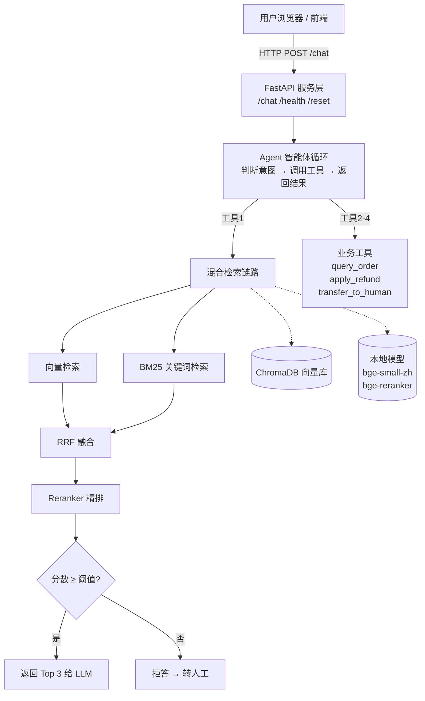

# 智能客服系统（RAG + Agent）

一个基于 RAG（检索增强生成）和 Agent（智能体）的企业级智能客服系统。

## 项目简介

传统的客服机器人只能回答预设问题，遇到新问题就束手无策。大模型虽然能回答各种问题，但会编造答案（幻觉），企业不敢用。

本项目把两者结合：

- 用 **RAG** 让大模型基于企业知识库回答，杜绝编造。
- 用 **Agent** 让大模型自主决策调用工具，处理订单、退款、转人工等业务。
- 用 **拒答机制** 保证知识库没有答案时，不乱回答，自动转人工。

最终交付一个任何人都能一条命令跑起来的完整系统。

## 核心功能

### 1. 混合检索（Hybrid Retrieval）

纯向量检索懂语义但不懂关键词，纯 BM25 懂关键词但不懂语义。

本项目把两者结合：

- **向量检索**：用 BAAI/bge-small-zh-v1.5 把问题和文档都转成向量，按语义相似度召回。
- **BM25 检索**：用 jieba 分词 + rank-bm25 做关键词召回，精准匹配“新疆”“黄金会员”等术语。
- **RRF 融合**：用倒数排名融合两条链的结果，互相纠错。
- **Reranker 精排**：用 BAAI/bge-reranker-base 对候选文档重排，取最相关的 Top 3。

### 2. 智能体（Agent）工具调用

基于 DeepSeek 的 Function Calling，LLM 自主决策调用哪个工具：

| 工具 | 用途 |
|---|---|
| `search_knowledge_base` | 查询公司政策知识库 |
| `query_order` | 查询订单物流状态 |
| `apply_refund` | 为用户申请退款 |
| `transfer_to_human` | 转接人工客服 |

### 3. 拒答兜底机制

Reranker 分数低于阈值时，系统不会强行回答，而是：

- 返回空结果给 LLM
- LLM 按系统提示词规则，自动转人工
- 避免大模型幻觉，保证回答可信

### 4. 多轮对话与会话隔离

- 每个用户通过 `session_id` 区分，对话历史独立存储。
- 支持多轮上下文理解。
- 服务重启后历史可继续（后续可扩展至 Redis 持久化）。

### 5. 查询改写（多轮对话）

多轮对话中用户常用指代词，直接检索会丢失上下文。例如：

- 用户：退款要几天到账？
- 用户：**那**运费呢？

系统通过独立的改写模块，结合最近 6 轮对话，把问题改写为完整问句，再去检索。

**设计原则**：
- 独立模块，便于单独评估和降级。
- 兼容 dict 和 OpenAI SDK 对象两种历史数据格式。
- 首轮对话不触发改写，避免无谓开销。

**已知局限**：当前 Prompt 覆盖了“指代补全”和“话题过渡”两类场景，但泛化能力有限。后续计划通过分类改写 + 独立评估集来提升通用性。

### 6. 全链路容器化部署

一条命令启动完整服务：

```bash
docker compose up --build
```

## 技术栈

| 类别 | 选型 | 说明 |
|---|---|---|
| 语言 | Python 3.12 | AI 生态最稳定的版本 |
| Web 框架 | FastAPI + Uvicorn | 高性能异步框架，自动生成 API 文档 |
| 嵌入模型 | BAAI/bge-small-zh-v1.5 | 中文优化，轻量，本地部署 |
| 重排模型 | BAAI/bge-reranker-base | Cross-Encoder，精排效果好 |
| 向量数据库 | ChromaDB | 轻量、持久化、支持余弦相似度 |
| 关键词检索 | rank-bm25 + jieba | 经典 BM25 算法，中文分词 |
| 大模型 | DeepSeek (deepseek-flash) | 国内直连，OpenAI 兼容接口 |
| 容器化 | Docker + Docker Compose | 一键部署，环境隔离 |

## 系统架构



## 评估结果

### 评估方法

构建了 15 个测试问题，覆盖两类场景：

- **12 个知识库内有答案的问题**：测试系统能否找到正确的知识片段。
- **3 个知识库内没有答案的问题**：测试系统能否正确拒答，不编造。

对每个问题取检索结果的 Top 3，检查是否命中预期来源和关键词。

### 评估指标

| 指标 | 结果 | 说明 |
|---|---|---|
| Recall@3 | **100%** | 12 个有答案的问题全部在前 3 条命中 |
| 拒答准确率 | **100%** | 3 个无答案的问题全部正确拒答并转人工 |

### 关键优化

评估过程中发现一个边界问题：用户问“你们支持货到付款吗？”，系统错误地返回了“不支持退款的情况”，因为两者共享“不支持”关键词，Reranker 给出了略高于阈值的分数。

**解决方案**：把 `RERANK_THRESHOLD` 从 0.1 调高到 0.2，让边缘相关的结果不再触发回答。

**验证结果**：拒答准确率从 66.7% 提升到 100%，同时 Recall@3 保持不变。

## 遇到的挑战与解决方案

### 挑战 1：Windows 下 PyTorch DLL 加载失败

**现象**：`OSError: [WinError 1114] 动态链接库(DLL)初始化例程失败，Error loading "c10.dll"`。

**定位过程**：
- 检查 `msvcp140.dll` 版本，发现是 14.29（Visual Studio 2019 时代）。
- 而 PyTorch 2.9.0+ 要求 VC++ 运行库版本 ≥ 14.40。
- 之前下载的是 `vs/16`（VS 2019）版本的运行库，需要换成 `vs/17`（VS 2022）。

**解决**：安装 VC++ 2022 运行库，`msvcp140.dll` 升级到 14.44，PyTorch 正常导入。

### 挑战 2：fastembed 在 Python 3.14 下静默崩溃

**现象**：`import fastembed` 无任何输出，Python 进程直接退出。

**定位过程**：
- 排除编码问题（已改为全英文）。
- 逐步测试依赖：`onnxruntime` 导入时静默崩溃。
- 确认 onnxruntime 的 Windows + Python 3.14 构建存在兼容性缺陷。

**解决**：从 Python 3.14 降级到 3.12，AI 生态最稳定的版本。所有依赖安装顺利。

### 挑战 3：Docker 构建 apt 源过慢

**现象**：`apt-get update` 从 `deb.debian.org` 下载，跑了 19 分钟还没完成。

**解决**：在 Dockerfile 里用 `sed` 把 Debian 源替换为阿里云源：

```dockerfile
RUN sed -i 's/deb.debian.org/mirrors.aliyun.com/g' /etc/apt/sources.list.d/debian.sources \
    && apt-get update && apt-get install -y --no-install-recommends build-essential \
    && rm -rf /var/lib/apt/lists/*
```

### 挑战 4：Linux 下 torch 默认拉取 CUDA 版（5GB+）

**现象**：`pip install torch` 在 Linux 里下载了 triton、nvidia-* 等几个 GB 的包。

**原因**：Linux 的 PyPI 默认源里，torch 是带 CUDA 支持的完整版本。

**解决**：在 `requirements.txt` 里明确指定 `torch==2.9.0+cpu`，并配置 PyTorch 官方 CPU 源。

### 挑战 5：模型文件过大，无法打包进镜像

**现象**：`bge-small-zh-v1.5` 和 `bge-reranker-base` 加起来几个 GB，如果打包进镜像，镜像会变成巨无霸。

**解决**：通过 Docker Volume 挂载本地模型目录：

```yaml
volumes:
  - ./models:/app/models:ro
```

镜像只包含代码和依赖，模型在运行时挂载进去。

## 快速开始

### 前置要求

- Docker Desktop（已启动，引擎正常运行）
- DeepSeek API Key（用于调用大模型）

### 第一步：获取代码

```bash
git clone https://github.com/你的用户名/customer-service-agent.git
cd customer-service-agent
```

### 第二步：配置 API Key

复制环境变量模板：

```bash
cp .env.example .env
```

编辑 `.env`，填入你的 DeepSeek API Key：

```
DEEPSEEK_API_KEY=sk-你的真实key
```

### 第三步：下载模型（首次运行）

从魔搭社区下载两个模型到本地 `models/` 目录：

```bash
pip install modelscope
modelscope download --model BAAI/bge-small-zh-v1.5 --local_dir ./models/bge-small-zh-v1.5
modelscope download --model BAAI/bge-reranker-base --local_dir ./models/bge-reranker-base
```

### 第四步：构建并启动服务

```bash
docker compose up --build
```

第一次构建约 5-15 分钟（需要下载依赖）。之后启动只需几秒。

### 第五步：访问服务

打开浏览器：

- 聊天界面：`http://localhost:8000/`
- API 文档：`http://localhost:8000/docs`

### 常用命令

```bash
# 后台运行
docker compose up -d

# 查看日志
docker compose logs -f

# 停止服务
docker compose down

# 重新构建（代码改动后）
docker compose up --build
```

## 项目结构

```
customer-service-agent/
├── app/
│   ├── __init__.py
│   ├── config.py                    # 全局配置（路径、模型、参数）
│   ├── main.py                      # FastAPI 入口
│   │
│   ├── knowledge/                   # 知识库模块
│   │   ├── loader.py                # 文档加载
│   │   ├── splitter.py              # Markdown 分层切分
│   │   ├── embedder.py              # 向量化（本地 bge 模型）
│   │   └── store.py                 # 写入 ChromaDB
│   │
│   ├── retrieval/                   # 检索模块
│   │   ├── dense.py                 # 向量检索
│   │   ├── sparse.py                # BM25 关键词检索
│   │   ├── hybrid.py                # RRF 融合
│   │   ├── reranker.py              # Cross-Encoder 精排
│   │   └── service.py               # 统一检索入口 + 拒答阈值
│   │
│   ├── agent/                       # 智能体模块
│   │   ├── prompt.py                # 系统提示词
│   │   ├── tools.py                 # 工具定义（4 个工具 + Schema）
│   │   └── core.py                  # Agent 循环
│   │
│   ├── api/                         # HTTP 接口
│   │   ├── schemas.py               # 请求/响应数据模型
│   │   └── routes.py                # 路由定义
│   │
│   └── static/
│       └── index.html               # 聊天界面
│
├── data/
│   ├── raw/                         # 原始知识文档（Markdown）
│   ├── chroma/                      # Chroma 向量库（自动生成）
│   └── eval_set.json                # 评估集（15 个问题）
│
├── models/                          # 本地模型（Volume 挂载）
│   ├── bge-small-zh-v1.5/
│   └── bge-reranker-base/
│
├── scripts/
│   ├── build_knowledge_base.py      # 一键建库
│   └── evaluate.py                  # 评估脚本
│
├── tests/
│   └── test_retrieval.py            # 检索测试
│
├── Dockerfile                       # 镜像构建
├── docker-compose.yml               # 容器编排
├── requirements.txt                 # Python 依赖
├── .env.example                     # 环境变量模板
├── .dockerignore                    # Docker 构建忽略
├── .gitignore                       # Git 忽略
└── README.md                        # 本文件
```

## API 接口

| 方法 | 路径 | 说明 |
|---|---|---|
| GET | `/health` | 健康检查 |
| POST | `/chat` | 发送消息，返回回答 |
| POST | `/reset/{session_id}` | 清空指定会话的对话历史 |

请求示例：

```json
POST /chat
{
  "message": "退款要几天到账？",
  "session_id": "user_abc123"
}
```

响应示例：

```json
{
  "reply": "退款到账时间根据支付方式不同：微信/支付宝 1-3 个工作日，银行卡 3-7 个工作日，余额即时到账。（来源：refund_policy.md）",
  "session_id": "user_abc123"
}
```

## 后续优化方向

- **知识库热更新**：加 `/admin/upload` 接口，支持后台上传文档并异步重建索引。
- **提示词注入防御**：输入层关键词过滤 + 检索结果用 `<document>` 标签隔离。
- **高并发支持**：会话迁移到 Redis，模型推理分离为独立服务，引入消息队列削峰。
- **语义缓存**：对相似问题直接命中缓存，降低延迟和成本。
- **多模态支持**：支持 PDF、Word、图片等格式的文档解析。